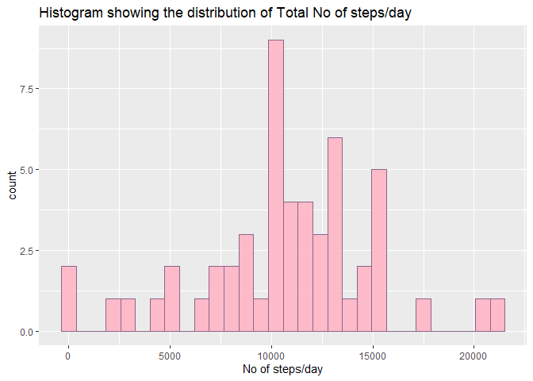
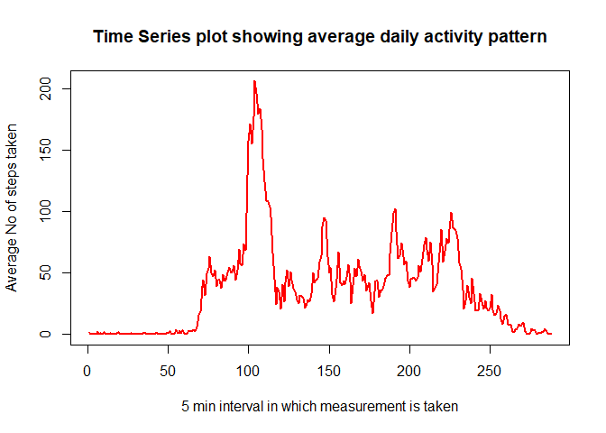
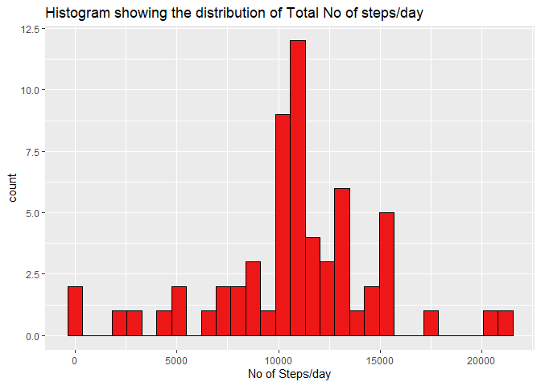
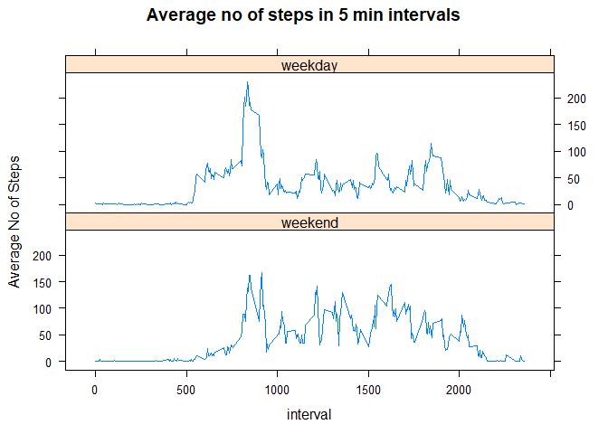

## Loading and preprocessing the data

At first I've read in the data from the CSV file.


```r
unzip("activity.zip")
data <- read.csv("activity.csv", na = "NA", header = TRUE)
data$date <- as.POSIXct(data$date)
```


## What is mean total number of steps taken per day?

This section includes three parts.  
1. At first I have found out the total No. of steps taken per day which is stored in data1.


```r
data1 <- tapply(data$steps, as.factor(data$date), sum)
data1 <- as.data.frame(data1)
x <- c("No of steps/day")
names(data1) <- x
head(data1)
```

```
##            No of steps/day
## 2012-10-01              NA
## 2012-10-02             126
## 2012-10-03           11352
## 2012-10-04           12116
## 2012-10-05           13294
## 2012-10-06           15420
```

2. Make a histogram for the total no of steps each day:


```r
library(ggplot2)
ggplot()+geom_histogram(data = data1, aes(`No of steps/day`),color = "plum4",fill ="pink1" ,alpha = 0.9)+ggtitle("Histogram showing the distribution of Total No of steps/day")
```

<!-- -->

3. Calculate the mean and median for number of steps taken/day

```r
a <- mean(data1$`No of steps/day`,na.rm = TRUE)
b <- median(data1$`No of steps/day`,na.rm = TRUE)
```

The mean of the total no of steps taken/day is 1.0766189\times 10^{4}.  
The median of the total no of steps/day is 10765.

## What is the average daily activity pattern?

This portion is divided into a couple of steps:  
1. Construction of a time series plot of the 5 min interval(x-axis) and the average no of steps taken averaged across all days(y-axis.)

```r
data2 <- tapply(data$steps, as.factor(data$interval),mean, na.rm = TRUE)
data2 <- as.data.frame(data2)
head(data2)
```

```
##        data2
## 0  1.7169811
## 5  0.3396226
## 10 0.1320755
## 15 0.1509434
## 20 0.0754717
## 25 2.0943396
```

```r
plot(data2$data2, type = "l", col = "red", lwd = 2, xlab = "5 min interval in which measurement is taken", ylab = "Average No of steps taken",main = "Time Series plot showing average daily activity pattern")
```

<!-- -->

2. Find the 5 min interval which contains the maximum no of steps:

```r
c <- max(data2)
library(dplyr)
d <- filter(data2, data2 == c)
max_5_min_int <- row.names(d)
```
The 5 min interval containing the maximum no of steps is 835.

## Imputing missing values
This section comprises of 4 parts:

1. Calculate the total no of NA values:

```r
total_na_vals <- sum(is.na(data))
```
The total no of NA values in the data set is2304.  

2. In order to fill in the missing values of the data set, I have decided to fill up the NA values with the group mean of the corresponding interval value.  

3. Create a data set with the missing values filled in the original data set.

```r
data3 <- data
data4 <- data3 %>%   group_by(interval)  %>% 
mutate(steps = ifelse(is.na(steps),mean(steps,na.rm = TRUE),steps))
head(data4)
```

```
## # A tibble: 6 x 3
## # Groups:   interval [6]
##    steps date                interval
##    <dbl> <dttm>                 <int>
## 1 1.72   2012-10-01 00:00:00        0
## 2 0.340  2012-10-01 00:00:00        5
## 3 0.132  2012-10-01 00:00:00       10
## 4 0.151  2012-10-01 00:00:00       15
## 5 0.0755 2012-10-01 00:00:00       20
## 6 2.09   2012-10-01 00:00:00       25
```

4. The final step includes making of a histogram of the total no of steps taken each day and reporting the mean and median of the total no of steps.

```r
data5 <- tapply(data4$steps, as.factor(data4$date),sum)
data5 <- as.data.frame(data5)
y <- c("No of Steps/day")
names(data5) <- y
head(data5)
```

```
##            No of Steps/day
## 2012-10-01        10766.19
## 2012-10-02          126.00
## 2012-10-03        11352.00
## 2012-10-04        12116.00
## 2012-10-05        13294.00
## 2012-10-06        15420.00
```

```r
ggplot()+geom_histogram(data = data5, aes(`No of Steps/day`),color = "black",fill ="red2" ,alpha = 0.9)+ggtitle("Histogram showing the distribution of Total No of steps/day")
```

<!-- -->

Calculation of the mean and median of the total no of steps.

```r
e <- mean(data5$`No of Steps/day`)
f <- median(data5$`No of Steps/day`)
```
The mean of the total no of steps/day is 1.0766189\times 10^{4}.  
The median of the total no of steps/day is 1.0766189\times 10^{4}.  
Observing the values of mean and median here, we can say that there hasn't been any significant difference in the values of mean and median from the first part of the assignment. In fact the values of the mean of the total no of days remain unchanged.  
As an impact of imputing the missing values with the estimates we see that the mean and median of the total no of steps/day are the same.

## Are there differences in activity patterns between weekdays and weekends?

This part comprises of two parts:  

1. Creation of a new factor variable in the data set with two levels - "weekdays","weekends"

```r
wdays1 <- c("Monday","Tuesday","Wednesday","Thursday","Friday")
data4$wday <- factor((weekdays(data4$date) %in% wdays1),levels = c(FALSE,TRUE),labels = c("weekend","weekday"))
head(data4)
```

```
## # A tibble: 6 x 4
## # Groups:   interval [6]
##    steps date                interval wday   
##    <dbl> <dttm>                 <int> <fct>  
## 1 1.72   2012-10-01 00:00:00        0 weekday
## 2 0.340  2012-10-01 00:00:00        5 weekday
## 3 0.132  2012-10-01 00:00:00       10 weekday
## 4 0.151  2012-10-01 00:00:00       15 weekday
## 5 0.0755 2012-10-01 00:00:00       20 weekday
## 6 2.09   2012-10-01 00:00:00       25 weekday
```

2.To make a panel plot containing a time series plot of the 5-minute interval (x-axis) and the average number of steps taken, averaged across all weekday days or weekend days (y-axis)


```r
library(plyr)
data6 <- ddply(data4, c("interval","wday"),summarise,steps=mean(steps))
head(data6)
```

```
##   interval    wday      steps
## 1        0 weekend 0.21462264
## 2        0 weekday 2.25115304
## 3        5 weekend 0.04245283
## 4        5 weekday 0.44528302
## 5       10 weekend 0.01650943
## 6       10 weekday 0.17316562
```

```r
library(lattice)
xyplot(steps ~ interval|wday,data = data6,type ="l",layout=c(1,2),ylab = "Average No of Steps",main = "Average no of steps in 5 min intervals" )
```

<!-- -->


